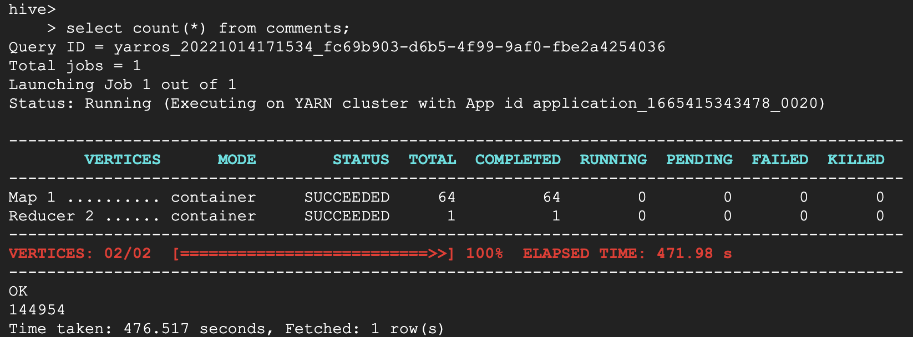
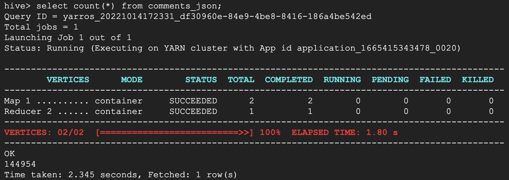
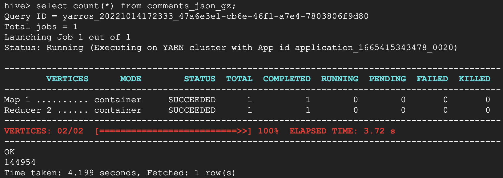
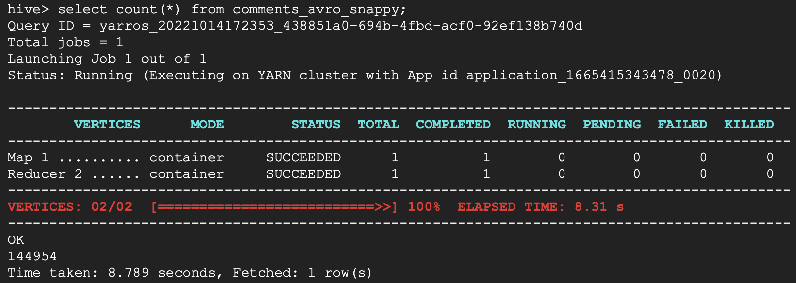
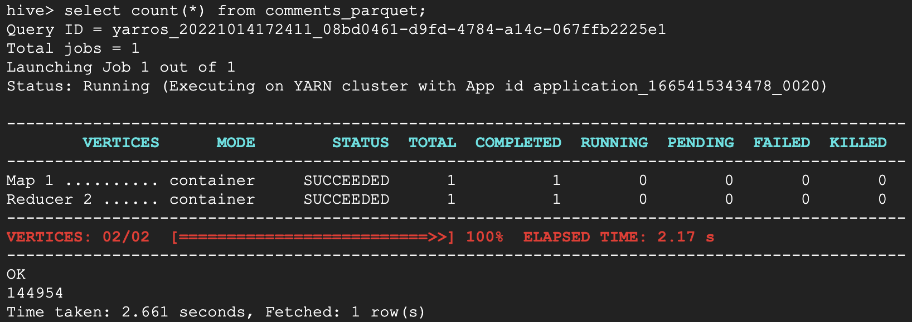
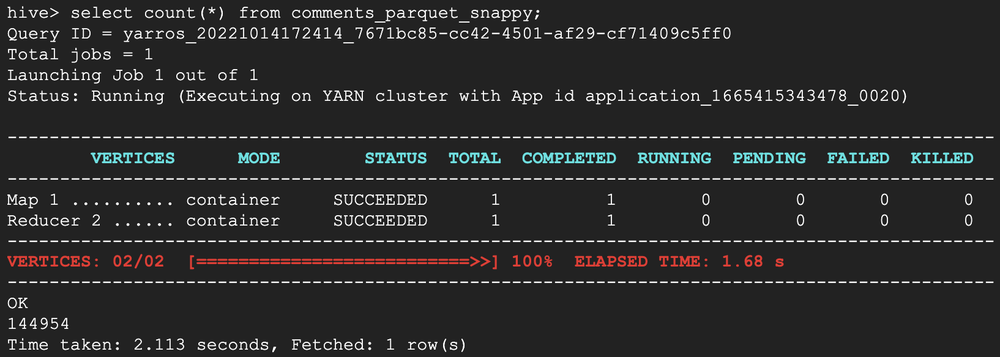
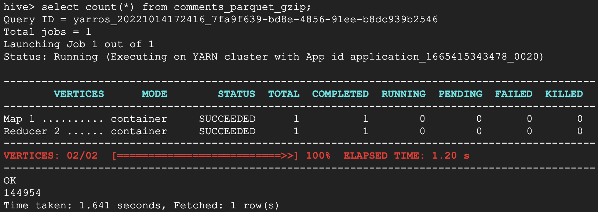

# gcp-file-compaction-poc

Proof-of-concept to showcase impact of file size on Hive external tables and query speeds

----

## Table Of Contents

1. [About](#about)
2. [Use Case](#use-case)
3. [Guide](#guide)
4. [Sample Queries](#sample-queries)
5. [Sample Output](#sample-output)


----

## about

One way to perform data analytics is through Hive on [Cloud Dataproc]().  You can create external tables in Hive, where the schema resides in Dataproc but the data resides in [Google Cloud Storage]().  This allows you to separate compute and storage, enabling you to scale your data independently of compute power.  

In older HDFS / Hive On-Prem setups, the compute and storage were closely tied together, either on the same machine or in a nearby machine.  But when storage is separated on the cloud, you save on storage costs at the expense of latency.  It takes time for Cloud Dataproc to retrieve files on Google Cloud Storage.  When there are many small files, this can negatively affect query performance.

File type and compression can also affect query performance.  It is important to be deliberate in choosing your Google Cloud Storage file strategy when performing data analytics on Google Cloud.


----

## use-case

This repository sets up a real-world example of comparing query performance between different file sizes on Google Cloud Storage.  It provides code that can perform **file compaction**, and in doing so, optimizes your query performance when using Cloud Dataproc + External Tables in Hive + data on Google Cloud Storage.

The setup script will create external tables with source data in the form of:
    - small raw json files
    - compacted json files
    - compacted compressed json files
    - compacted csv files
    - compacted compressed csv files
    - compacted parquet files
    - compacted compressed parquet files
    - compacted avro files
    - compacted compressed avro files

Finally, it will show you how to query all of the tables and demonstrate query run times for each source data / file format.

----

## guide


Do the following sample guide to generate many small files in Google Cloud Storage:

https://github.com/CYarros10/gcp-dataproc-workflow-template-custom-image-sample

Then:

```bash
git clone https://github.com/CYarros10/gcp-file-compaction-poc.git

cd gcp-file-compaction-poc

chmod 777 ./scripts/setup.sh

./scripts/setup.sh <project_id> <project_number> <region> <dataset> <table>
```

----

## sample-queries

**Hive**

```sql

msck repair table comments;
msck repair table comments_csv;
msck repair table comments_csv_gz;
msck repair table comments_json;
msck repair table comments_json_gz;
msck repair table comments_avro;
msck repair table comments_avro_snappy;
msck repair table comments_avro_deflate;
msck repair table comments_parquet;
msck repair table comments_parquet_snappy;
msck repair table comments_parquet_gzip;

add jar /lib/hive/lib/hive-hcatalog-core-2.3.7.jar;
add jar /lib/hive/lib/json-1.8.jar;
add jar /lib/hive/lib/json-path-2.1.0.jar;
add jar /lib/hive/lib/json4s-ast_2.12-3.5.3.jar;
add jar /lib/hive/lib/json4s-core_2.12-3.5.3.jar;
add jar /lib/hive/lib/json4s-jackson_2.12-3.5.3.jar;
add jar /lib/hive/lib/json4s-scalap_2.12-3.5.3.jar;

select count(*) from comments;
select count(*) from comments_csv;
select count(*) from comments_csv_gz;
select count(*) from comments_json;
select count(*) from comments_json_gz;
select count(*) from comments_avro;
select count(*) from comments_avro_snappy;
select count(*) from comments_avro_deflate;
select count(*) from comments_parquet;
select count(*) from comments_parquet_snappy;
select count(*) from comments_parquet_gzip;
select count(*) from comments_csv;
select count(*) from comments_parquet;

```

----

## sample-results

The processed files in Google Cloud Storage will contain analyzed/processed comments such as this:

(different row counts based on loads)

comments = 6851 x 10kb files = 



comments_csv


comments_csv_gz


comments_json



comments_json_gz



comments_avro


comments_avro_snappy



comments_avro_deflate


comments_parquet



comments_parquet_snappy



comments_parquet_gzip



comments_csv


comments_parquet

